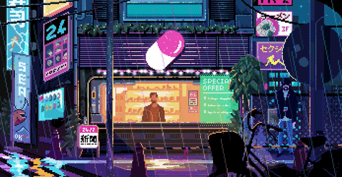

<div align="center">
  
</div>

<br/>

<div align="center">

### `[ ERROR 404: Sleep not found. Shipping anyway. ]`

*they said pick a lane. I picked all of them.*

</div>

---

<div align="center">

```
  ____  ______                                                        
 |  _ \|  ____|                                                       
 | |_) | |__                                                          
 |  _ <|  __|                                                         
 | |_) | |____                                                        
 |____/|______|_   _  _____ _____  _____ _______ ______ _   _ _______ 
  / ____/ __ \| \ | |/ ____|_   _|/ ____|__   __|  ____| \ | |__   __|
 | |   | |  | |  \| | (___   | | | (___    | |  | |__  |  \| |  | |   
 | |   | |  | | . ` |\___ \  | |  \___ \   | |  |  __| | . ` |  | |   
 | |___| |__| | |\  |____) |_| |_ ____) |  | |  | |____| |\  |  | |   
  \_____\____/|_| \_|_____/|_____|_____/   |_|  |______|_| \_|  |_|   
                                                                      
  ```                                                                    

</div>

---

- Building real systems in **Flutter · Go · .NET 8 · Python · Java** — not tutorials, not toys
- Working on **AI pipelines, computer vision, and production backends**
- Ask me about **Flutter · Go · .NET · YOLOv8 · System Design · gRPC · Android**
- Currently shipping **[PULSE](https://github.com/MuaazTasawar/pulse-news-app)** · **[NeuralVault](https://github.com/MuaazTasawar/NeuralVault)** · **[SafeVision AI](https://github.com/MuaazTasawar/SafeVision-AI)**
- 📬 Reach me at **[muaaztasawar1@email.com](mailto:muaaztasawar1@email.com)**

---

## 🛠️ Tech Stack

<div align="center">

**Languages**


**Web & Backend**


**Databases & Cloud**


**Tools & DevOps**


</div>

---

## 🚀 Featured Projects

<table>
  <tr>
    <td width="50%">
      <h3>🧠 NeuralVault</h3>
      <p>Real-time AI knowledge base. Clean Architecture, CQRS, SignalR, ML.NET semantic similarity & clustering, Redis, JWT.</p>
      
      
      
      <br/><br/>
      <a href="https://github.com/MuaazTasawar/NeuralVault">View Project →</a>
    </td>
    <td width="50%">
      <h3>⚙️ go-taskmaster</h3>
      <p>Production Go API — dual REST + gRPC servers, goroutine worker pool, token bucket rate limiter, all 4 gRPC streaming patterns.</p>
      
      
      
      <br/><br/>
      <a href="https://github.com/MuaazTasawar/go-taskmaster">View Project →</a>
    </td>
  </tr>
  <tr>
    <td width="50%">
      <h3>📡 PULSE</h3>
      <p>AI-powered geopolitical news app. RAG pipeline with Gemini, interactive world map, live markets, price alerts, full offline mode.</p>
      
      
      
      <br/><br/>
      <a href="https://github.com/MuaazTasawar/pulse-news-app">View Project →</a>
    </td>
    <td width="50%">
      <h3>🦺 SafeVision AI</h3>
      <p>Real-time PPE detection for construction sites. YOLOv8 (mAP50: 0.617), FastAPI WebSocket stream, Flutter BLoC + Custom Painter.</p>
      
      
      
      <br/><br/>
      <a href="https://github.com/MuaazTasawar/SafeVision-AI">View Project →</a>
    </td>
  </tr>
</table>

---

## 📊 Stats

<div align="center">


&nbsp;&nbsp;


</div>

<div align="center">


</div>
<div>
<div align="center">

###
`while(alive) { eat(); code(); ship(); repeat(); }`

</div>


</div>
